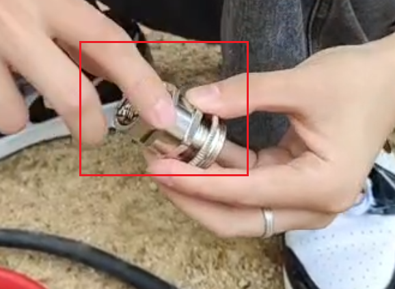

# arm_kuka.md

##### 电源盒

把电源盒接头处拧掉取出里面的铁块

铁块取出后再把接头处拧上

接头处左右两侧螺丝拧松

后端拧回电源盒上

把6平方多股线从外面穿进电源盒

三根线分别接入1 2 3 孔 （3个孔随便接 不用管线的颜色）

（注：正反两面孔位都有数字）

侧边拧螺丝加固

把接好的线收回电源盒中并拧紧螺丝固定

##### 安全回路接口

把安全阀盒打开

0.5平方单股线两头用冷压针固定（做14根），插入对应的孔内

（注：两面都有数字）

(一根线插两个孔）

第一排：1和2短接  3和4短接  5和6短接  7和8短接  9和10短接  11和12短接  13和14短接 

第二排：15和16短接  17和18短接  19和20短接  21和22短接  23和24短接  25和26短接 27和28短接

把有线的那面朝下，放回安全阀盒内并固定螺丝

找到X11位置并固定

##### 编码器线

一端固定在X21处

另一端固定在X31处

##### 动力线

一端固定在X30处并拧好螺丝

另一端固定在X20处

##### 控制箱内开关

打开控制箱找到左侧开关按钮，向右上扭动

右侧找到A1-X305的线插到电路板上

##### 遥控器

插入X19位置

##### 完成！

