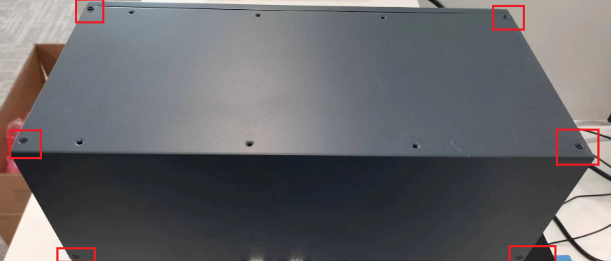
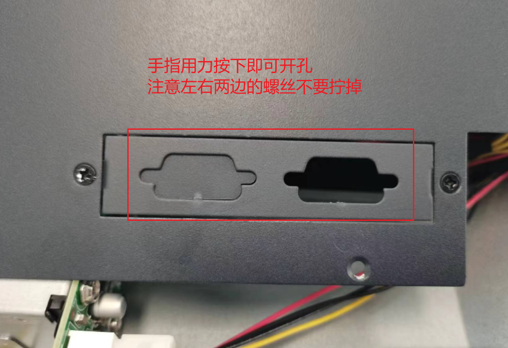
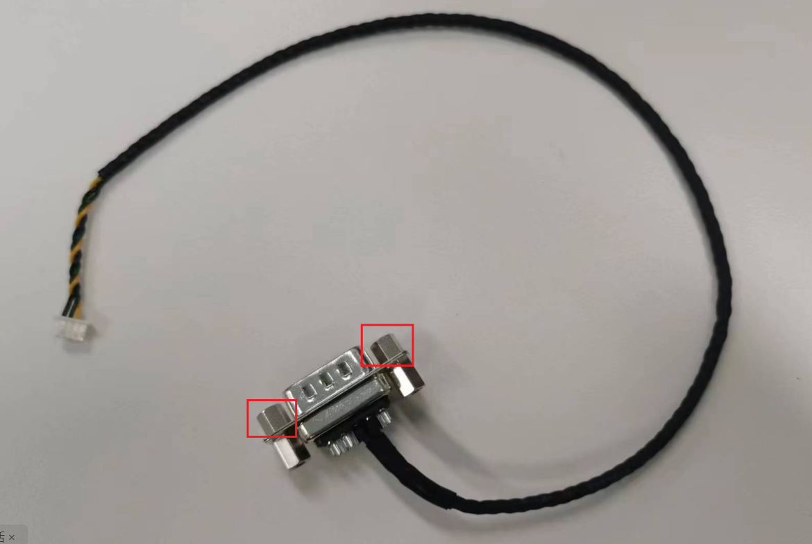
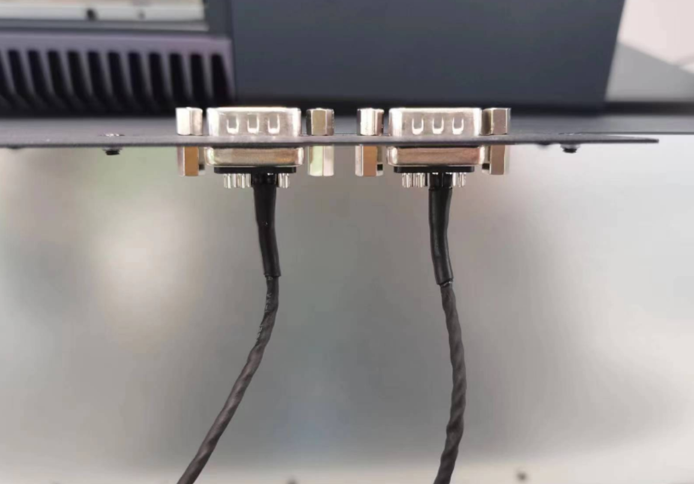
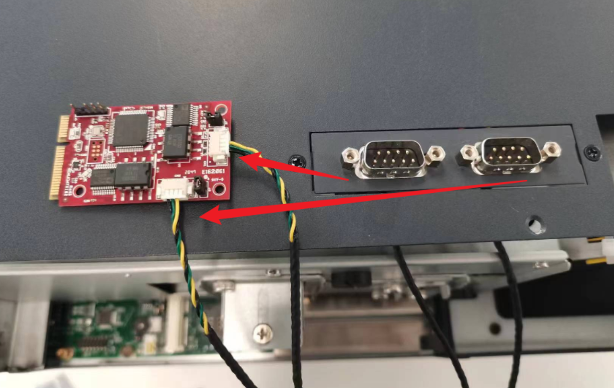
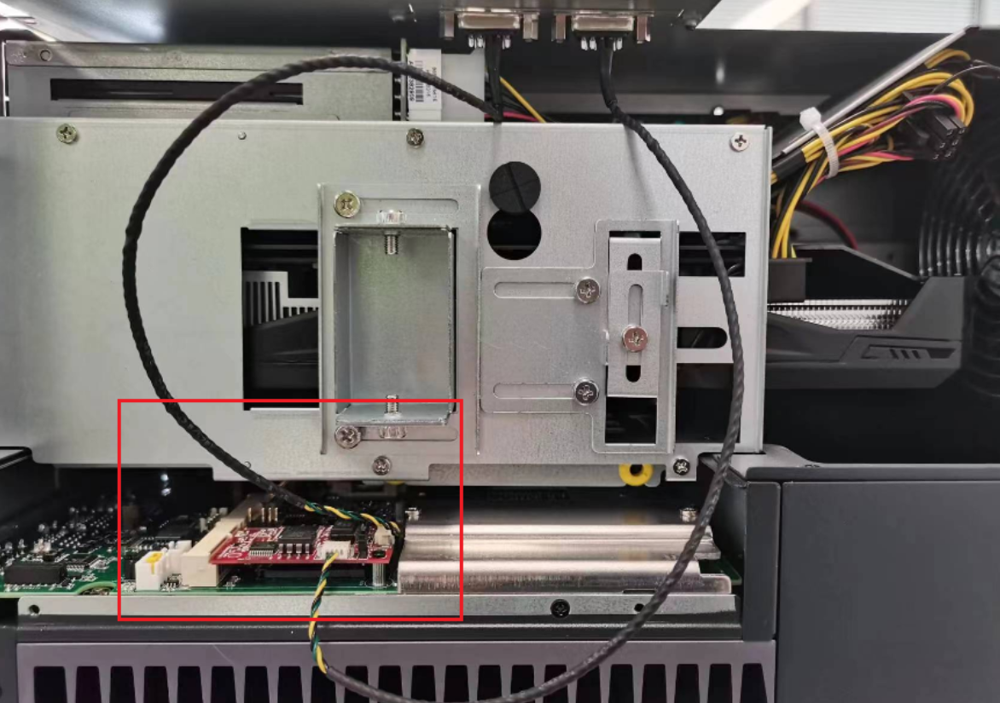
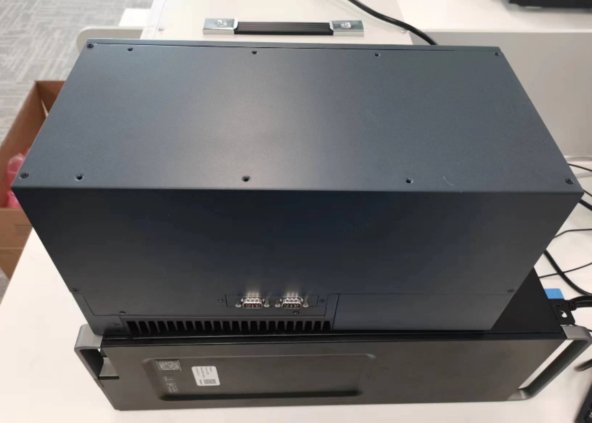
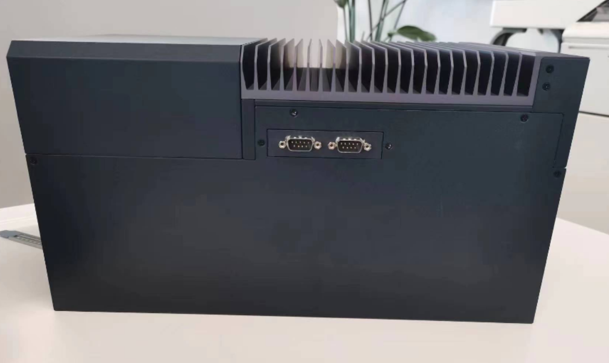
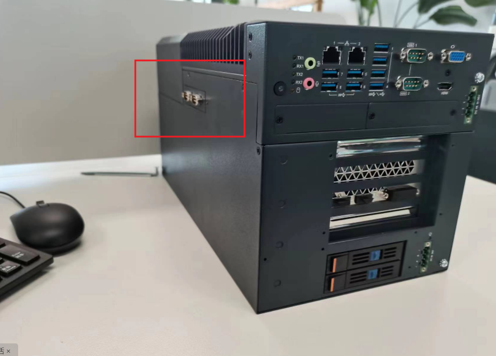

# can卡安装

> 第1步：首先拆掉挡板两侧的螺丝
>
> 第2步：把挡板一侧的孔扣开
>
> 第3步：can卡接入
>
> 第4步：插入工控机
>
> 第5步：装上挡板 拧好螺丝
>
> 安装完成！！！

##### 第1步：首先拆掉挡板两侧的螺丝

##### 第2步：把挡板一侧的孔扣开

##### 第3步：can卡接入

3.1：螺丝拧掉

3.2：从挡板下面穿过并固定螺丝

3.3：另外两端分别插入

##### 第4步：插入工控机

（前端插入凹槽，后端用小螺丝固定，不然会翘边）

##### 第5步：装上挡板 拧好螺丝

安装完成！！！

