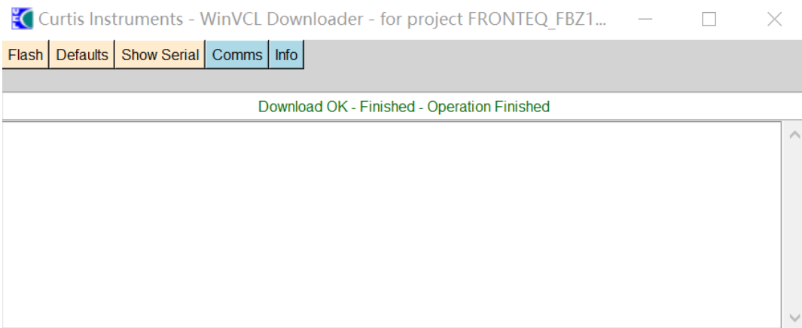

# drive_curtis

第1步：.连接好调试线，确认驱动正常

（一端插在车上一端插在电脑上）

第2步：拷贝底盘电机驱动器数据

打开1314-4402 PC Programming Station (OEM)软件 点击页面左边第一个按钮

然后点击File 选择Save As另存为

拷贝时记得备注左右电机以免搞混

第3步：打开调试软件，选择端口Comms->Set COM Port->COM xx；

查看电脑端口：找到此电脑➡右击管理➡设备管理器➡端口

设置COM端口

4.点击刷写Flash，进度条走完后，根据提示操作；

下载操作完成后，车辆断电5s重启

5.重启后，用1314-4402 PC Programming Station (OEM)软件刷入参数。

点击连接系统

打开自己需要烧录的文件

点击烧录

车辆断电5s

看到提示后打开电源

烧录完成！