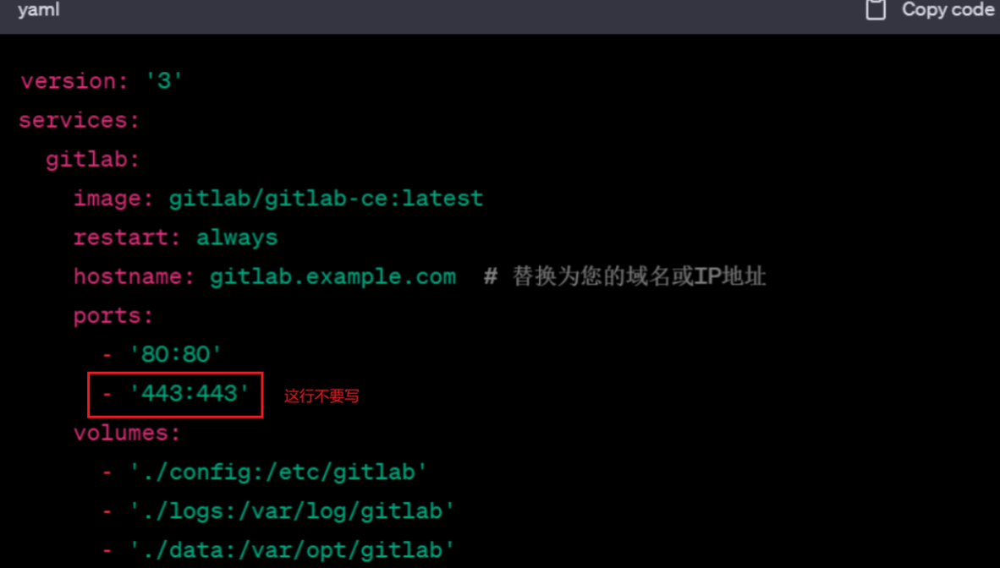
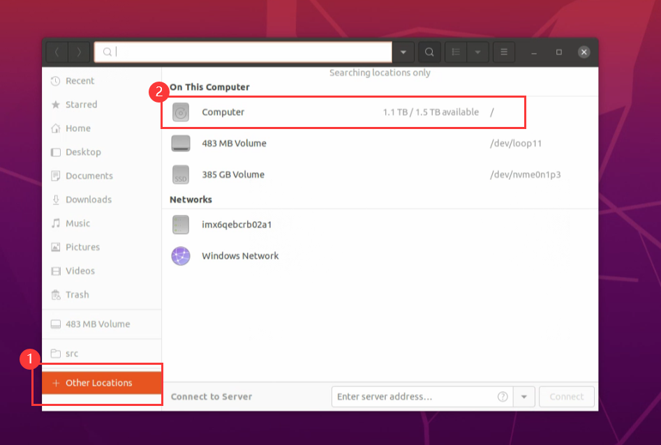
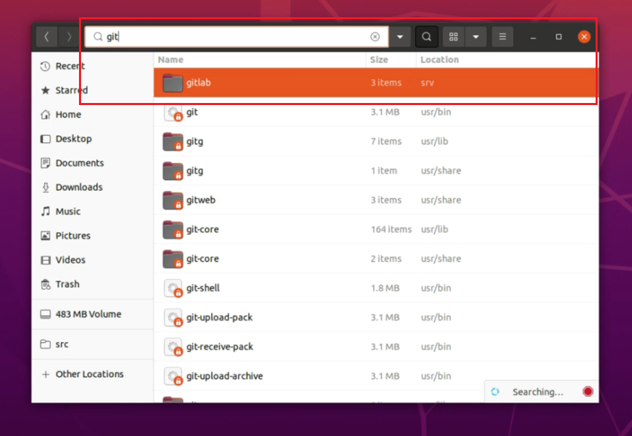
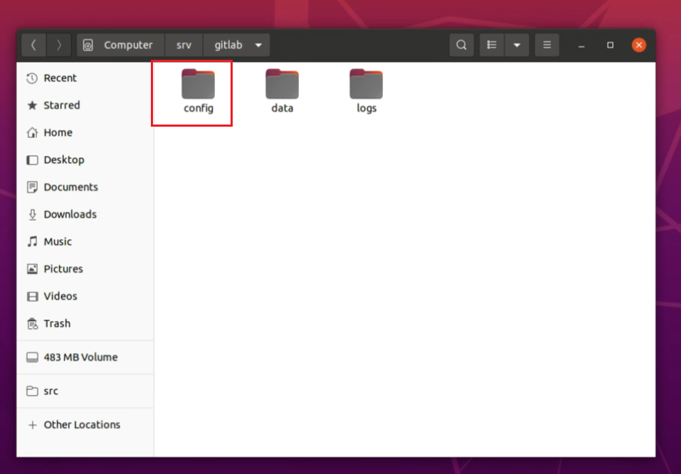
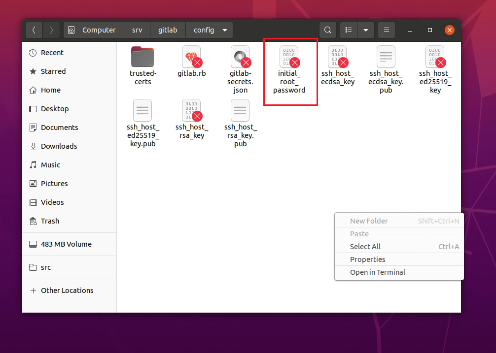
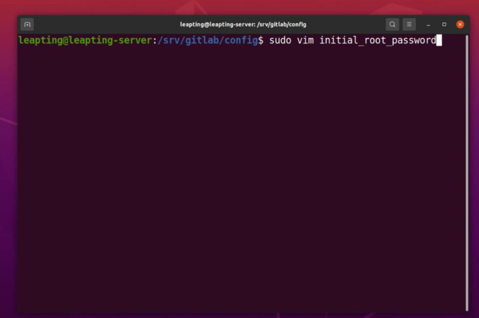
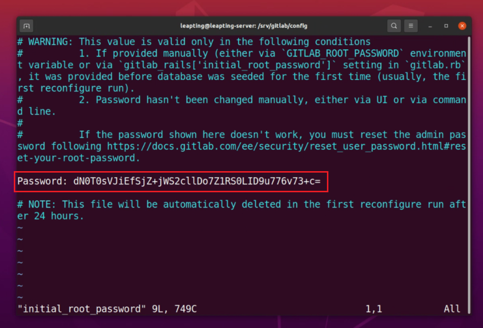

# gitlab

创建一个目录来存储GitLab数据。例如，您可以在服务器上创建/srv/gitlab目录来存储配置、日志和数据。确保该目录对Docker用户可写。

在服务器上创建一个新的文件夹，例如/srv/gitlab/config，用于存储GitLab的配置文件。创建一个名为docker-compose.yml的文件，并将以下内容复制到文件中：

（请注意格式）

version: '3'
services:
  gitlab:
    image: gitlab/gitlab-ce:latest
    restart: always
    hostname: gitlab.example.com # 替换为您的域名或IP地址
    ports:
      \- '80:80'
    volumes:
      \- './config:/etc/gitlab'
      \- './logs:/var/log/gitlab'
      \- './data:/var/opt/gitlab'

确保将gitlab.example.com替换为您的域名或IP地址，并将/srv/gitlab替换为您选择的数据目录路径。保存并关闭docker-compose.yml文件。

在包含docker-compose.yml文件的目录中，使用以下命令启动GitLab容器

docker-compose up -d

这将下载GitLab镜像并在后台启动容器。请注意，首次启动GitLab可能需要一些时间来完成初始化。当容器启动完成后，您可以使用以下命令检查GitLab容器的状态

docker-compose ps

一旦状态显示为"Up"，表示GitLab已成功运行。现在，您可以在浏览器中访问http://gitlab.example.com（或您的域名/ IP地址），您将看到GitLab的欢迎页面。

首次访问GitLab时，您将被要求设置管理员账户和密码。请按照页面上的指示进行操作。

gitlab查看初始用户名和密码：

1.点击Other Locations➡点击computer

2.找到自己下载的gitlab并点击进去

3.然后点击config

4.看到initial_root_password，在此打开一个终端

5.输入sudo vim initial_root_password

6.密码

