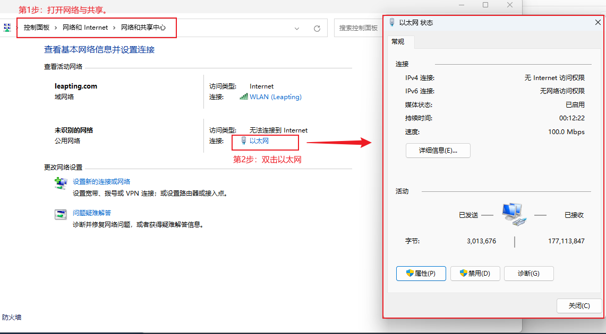
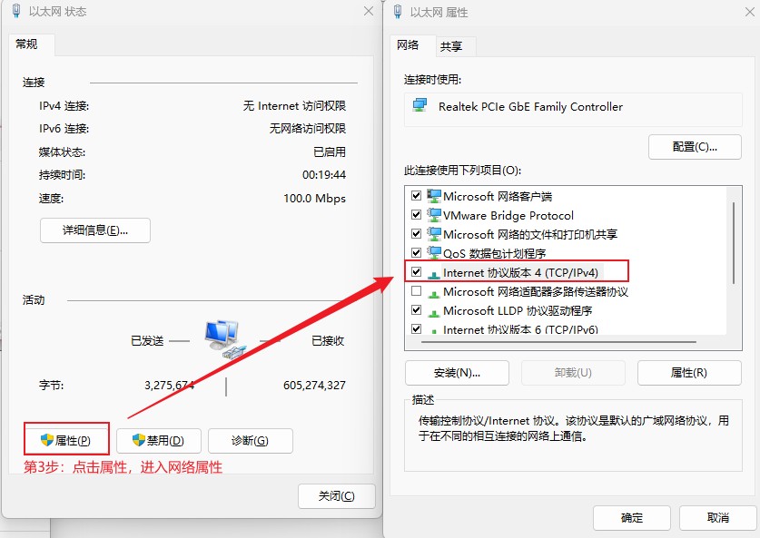
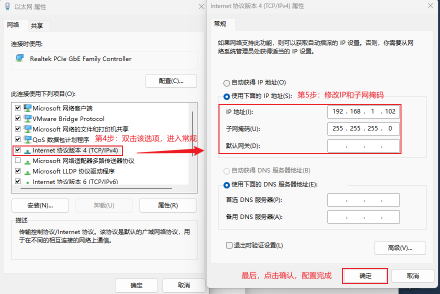
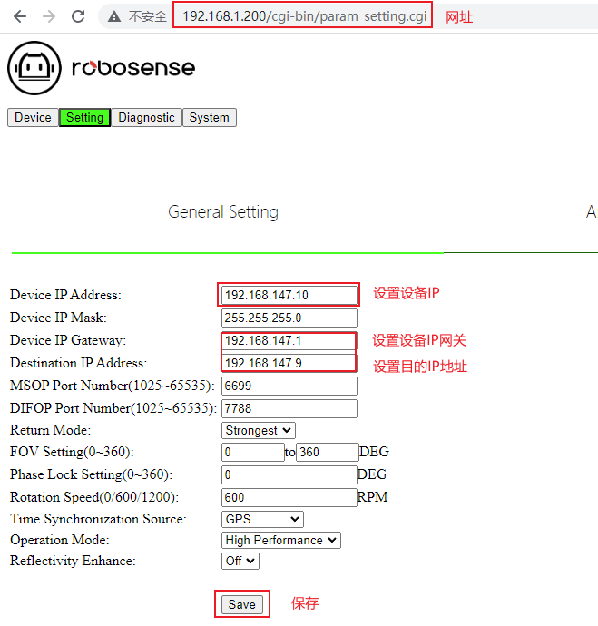
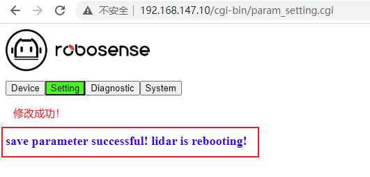

# rs16p的教程指南

> 一共6步：
>
> 第1步：打开网络与共享
>
> 第2步：双击以太网
>
> 第3步：点击属性 进入网络属性
>
> 第4步：双击该选项，进入常规
>
> 第5步：修改IP和子网掩码
>
> 第6步：打开浏览器进入[网页](http://192.168.1.200/cgi-bin/param_setting.cgi)

#### 第1步：打开网络与共享

#### 第2步：双击以太网

#### 第3步：点击属性 进入网络属性

#### 第4步：双击该选项，进入常规

#### 第5步：修改IP和子网掩码

#### 第6步：打开浏览器进入[网页](http://192.168.1.200)

注：输入http://192.168.1.200，即可，他会自动补全后面的路径

#### 修改成功

