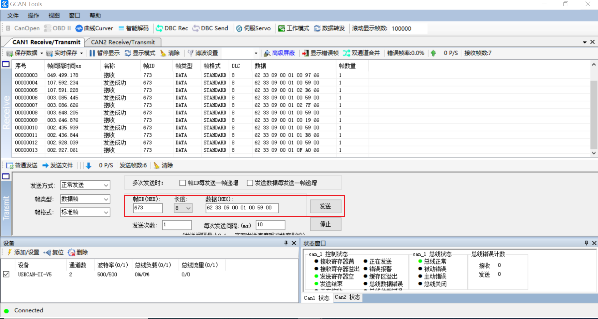

# 点激光can通信配置说明

第1步：传感器连接ttl转USB线然后连接电脑

5V连5V，DND连GND

TXD连RX,TX连RXD

第2步：打开SSCOM串口调试软件，选择通信端口  COM3 USB-SERIAL CH340

第3步：打开串口波特率设置115200

第4步：设置地址

输入62 32 09 FF FF 00 01 00点击发送

第5步：查询距离

输入 62 33 09 FF FF 00 02 00

##### can通信配置

第1步：下载软件：gcantools

下载连接：http://www.gcgd.net/tecinfo1_1582.html

第2步：传感器连接ttl转can然后连接电脑

（注意：连接上电源后不要用手触碰模块也不要让模块碰到金属，否则容易短路）

can1的L和H

红接H，黑接L

第3步：打开设备 波特率设置500k

第4步：把帧id设置成模块上的数字然后发送62 33 09 00 01 00 59 00

（62 33 09 00 01 00 59 00可以多发送几次，转动传感器观察距离变化）

完成！